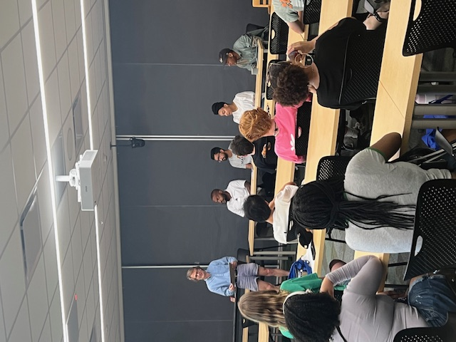

```{r setup, include=FALSE}
knitr::opts_chunk$set(echo = TRUE)
```
Today I participated on a panel for a [4-H Career Explorations Event](https://www.nys4-h.org/career-explorations-2025) 



It was great to share my experiences so far along my botany journey. Twas a good time, but one of the kiddos came up to me afterwards and said I look like tyler the creator... surprisingly that was not the first time i have heard that... 