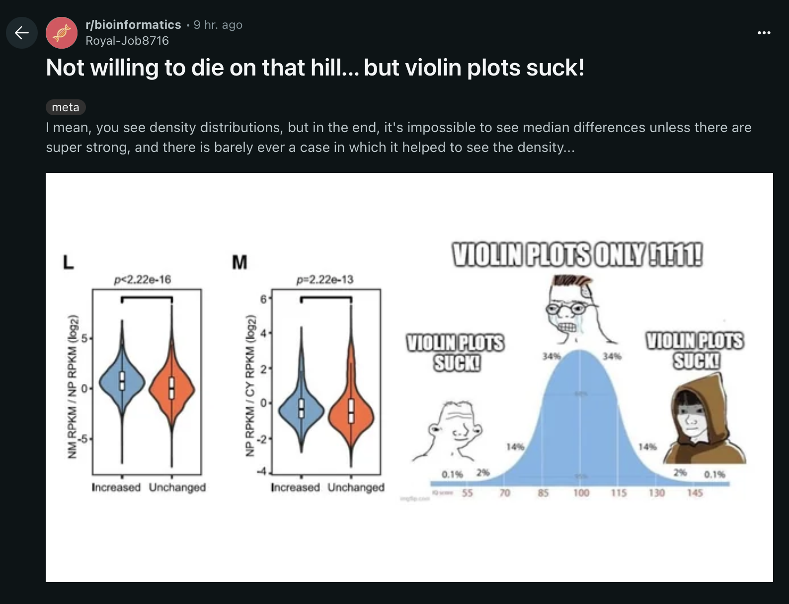

```{r setup, include=FALSE}
knitr::opts_chunk$set(echo = TRUE)
library(webshot2)
```
i was browsing on reddit and came across this post in r/bioinformatics: <br>




in the comments somebody mentioned using raincloud plots instead! I am about to go to the botany conference and give a poster and presentation -- i def plan to use rainclouds instead of box plots!

knitr::include_url(https://rpubs.com/rana2hin/raincloud)

